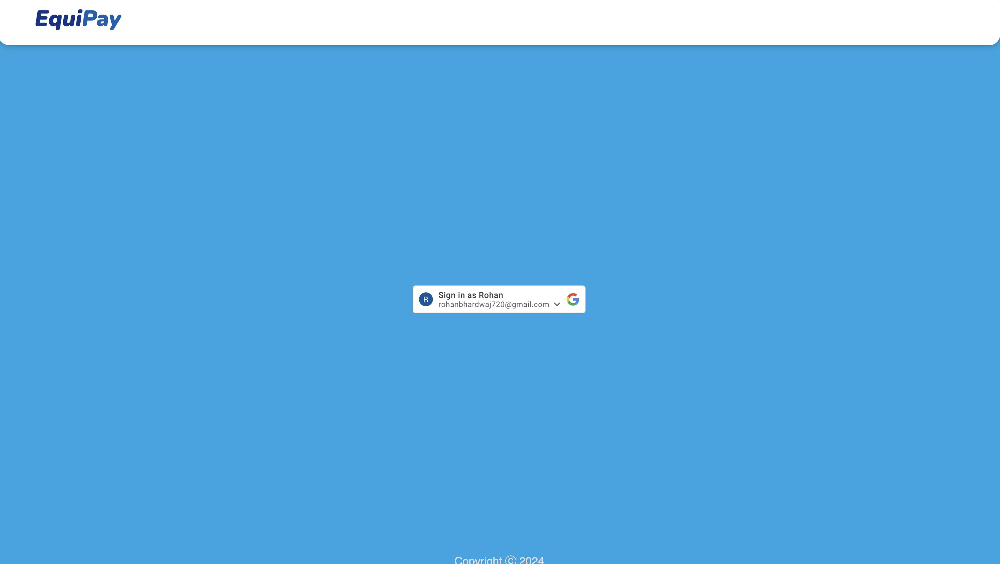
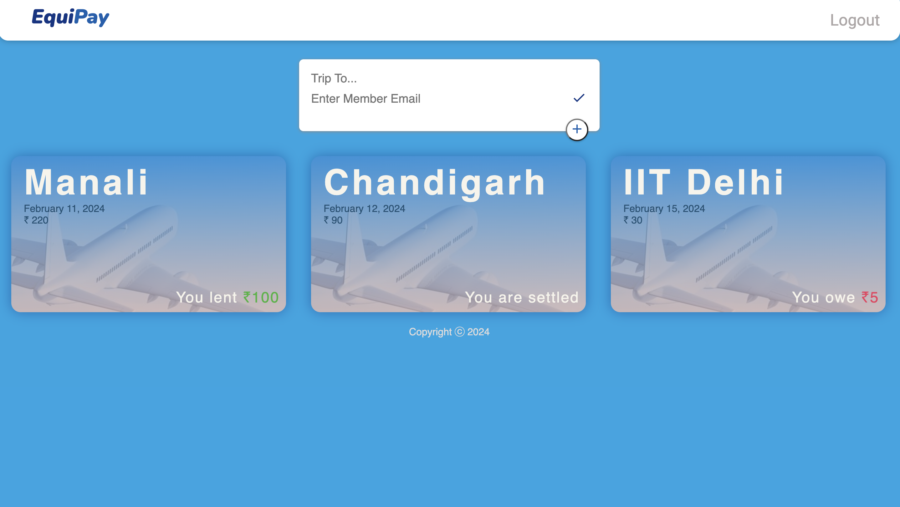
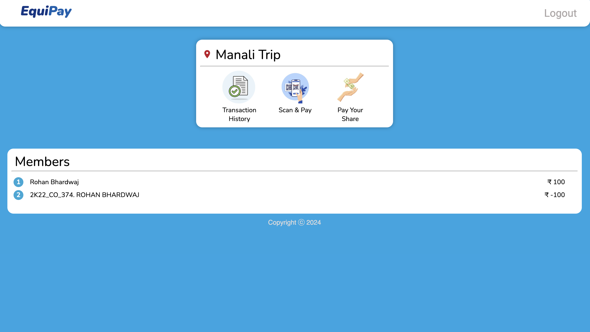
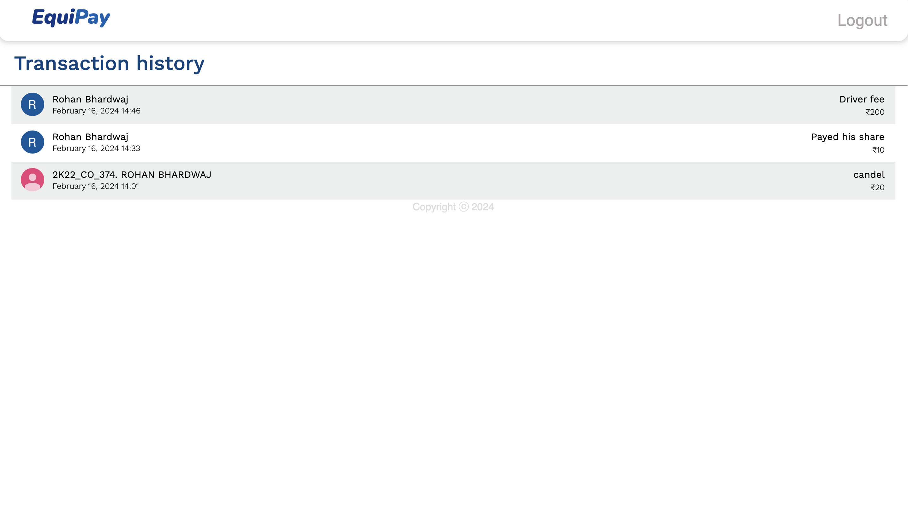

# Equipay

## Introduction

Equipay is a financial management web application designed to simplify the process of managing and splitting expenses among participants of a trip.

## Key Features

- **Trip Creation**: Organize your travel plans and associated members.
- **Transaction Tracking**: Log every expense incurred by trip participants.
- **Equal Splitting**: Automatically calculate how much each member owes or is owed.
- **Easy Settlements**: Facilitate direct payments between members to settle debts.
- **User-Friendly Interface**: Intuitive design for seamless navigation and usage.
- **Direct UPI Payments**: (Upcoming) Integrate a payment gateway for direct UPI transactions.

## Tech Stack

This project is built using the following technologies:

- **PostgreSQL**: SQL database for structured data storage.
- **Express.js**: Web application framework for Node.js.
- **React**: Frontend library for building user interfaces.
- **Node.js**: JavaScript runtime for the backend.

## Screenshots

- Login Page
 
- Home Page
 
- Trip
 
- Transaction History
 

## Getting Started

To get a local copy up and running, follow these simple steps.

### Prerequisites

- Node.js
- npm

### Installation

1. Clone the repo

```sh
git clone https://github.com/RohanBhardwaj720/Equipay.git
```

2. Install NPM packages

```sh
npm install
```

3. Start the Backend Server

```sh
node server.mjs
```

4. Start the Frontend

```sh
npm start
```
